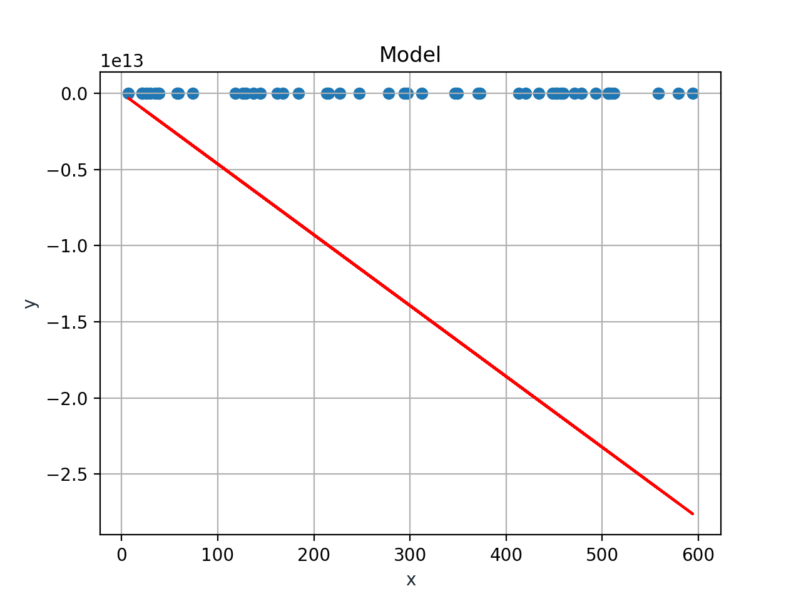
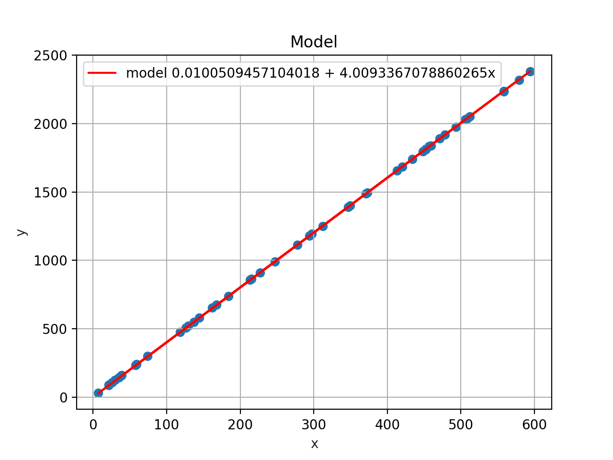
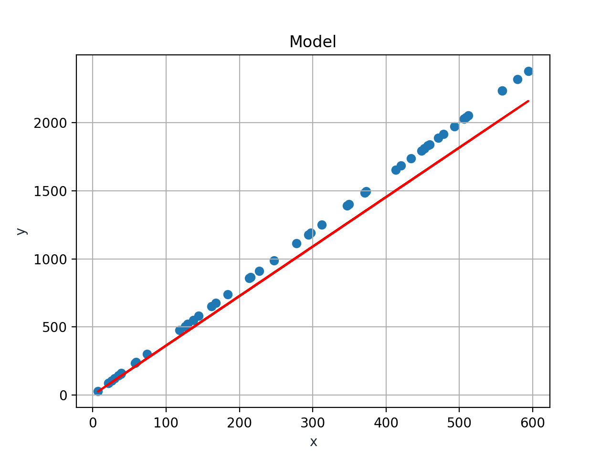

## Notes

- Learing rate should enough well

## Model

I generate dataset with 50 pair (X, Y), cost(X) = eth_0 + eth_1 \* X.

Case 1000 loops and learning rate(alpha) = 1e-5 = 0.00001

```
eth_0 = -50628.24363515939
eth_1 = -46475134157.405426
loss = 2.534607882689012e+26
```



Case 1000 loops and learning rate(alpha) = 1e-7 = 0.0000001

```
eth_01 = 0.0100509457104018
eth_02 = 4.0093367078860265
loss = 5.575004623664026
```



Case 100 loops and learning rate(alpha) = 1e-7 = 0.0000001

```
eth_01 = 0.008944685371352479
eth_02 = 3.636380820217009
loss = 16328.227819639962
```



# Ref

- [Gradient Descent - Blog machinelearningcoban.com](https://machinelearningcoban.com/2017/01/12/gradientdescent/)
